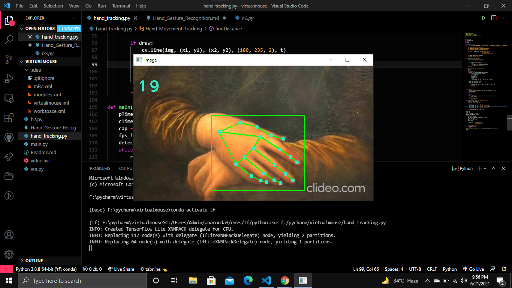
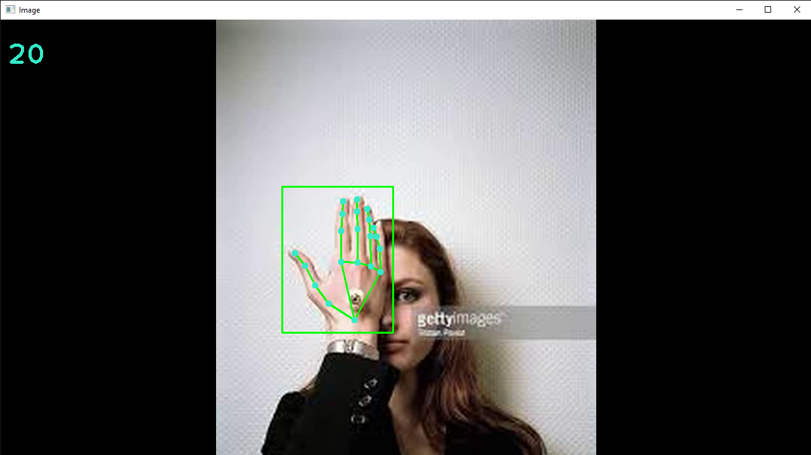
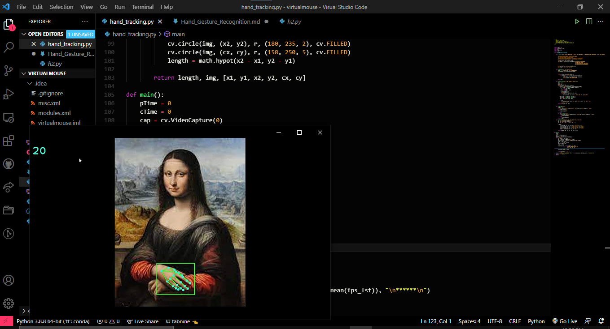
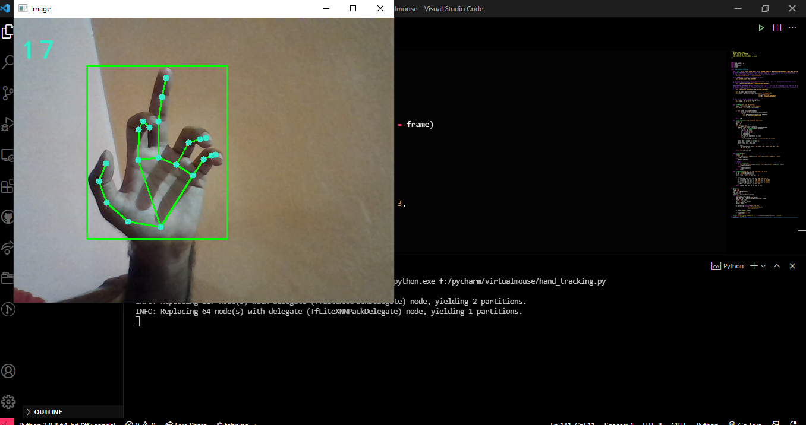

# Hand Movement Tracking

### As the name suggests, this module traces the hand's movement and draws landmark points on hand by using `OpenCV` and `Mediapipe` library.

## Requirements
    - Python
    - OpenCV
    - Mediapipe

### The following image taken from the `Mediapipe` documentation shows the 21 landmarks in hand start with 0 {wrist} to 20 {Pinky tip}

## Outputs Images
## 1.

## 2.

## 3.

## 4.
